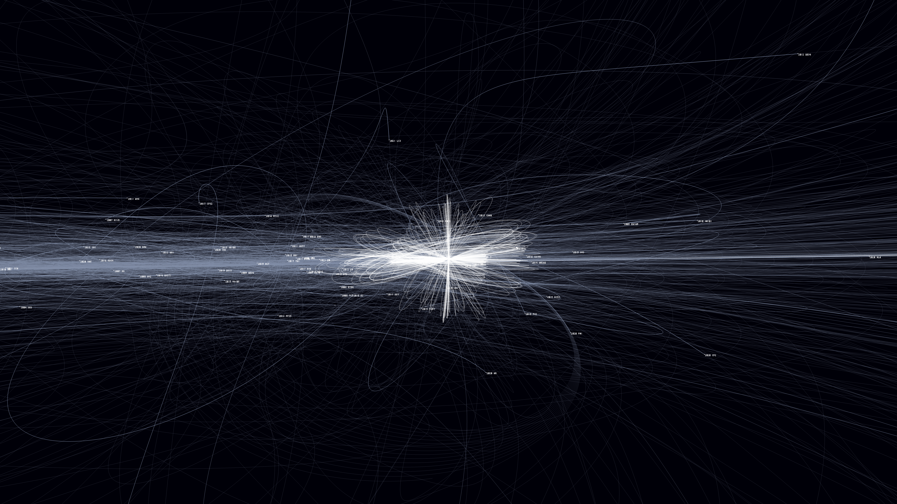
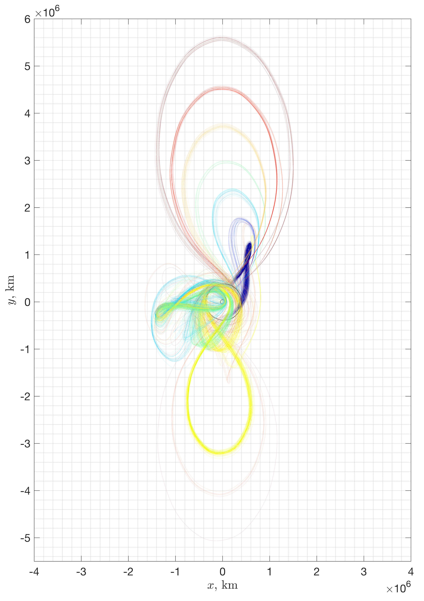
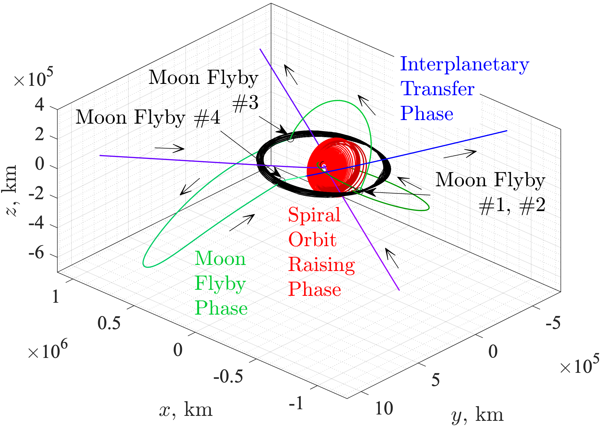
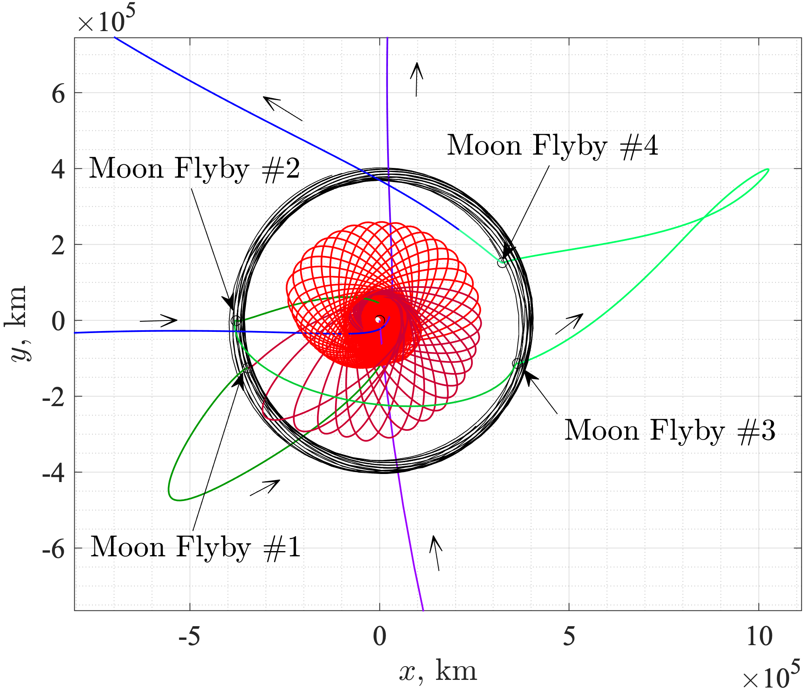

## 👋　Hi there, I'm Naoya Ozaki

Associate Professor and Mission Designer at the Institute of Space and Astronautical Science, Japan Aerospace Exploration Agency (JAXA).

## 🎨 Trajectory Gallery

### Asteroid Flyby Cycler Trajectories

<!--- [Add a brief description of the visualization and your contribution.] --->

### Moon Flyby Trajectories

<!--- [Add a brief description of the visualization and your contribution.] --->

<!--- ### Spiral Orbit Raising and Lunar Flybys

A trajectory visualization showing spiral orbit raising,
multiple lunar flybys, and the transition to interplanetary transfer.

### Rotating-Frame View

A complementary view highlighting the trajectory geometry
and lunar flyby sequence.

[Add the project name, figure credits, and a paper or project link.] --->

<!--
**naoyaozaki/naoyaozaki** is a ✨ _special_ ✨ repository because its `README.md` (this file) appears on your GitHub profile.

Here are some ideas to get you started:

- 🔭 I’m currently working on ...
- 🌱 I’m currently learning ...
- 👯 I’m looking to collaborate on ...
- 🤔 I’m looking for help with ...
- 💬 Ask me about ...
- 📫 How to reach me: ...
- 😄 Pronouns: ...
- ⚡ Fun fact: ...
-->
